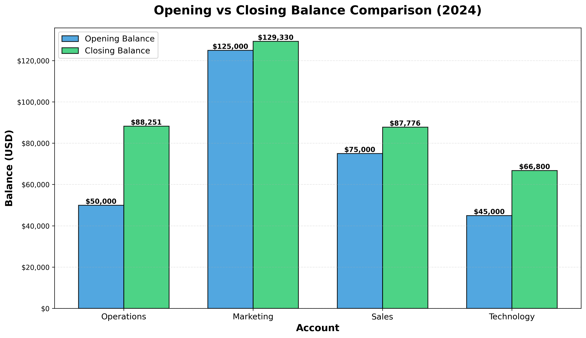
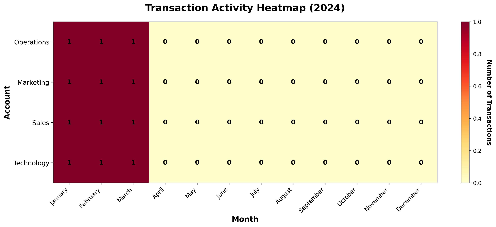
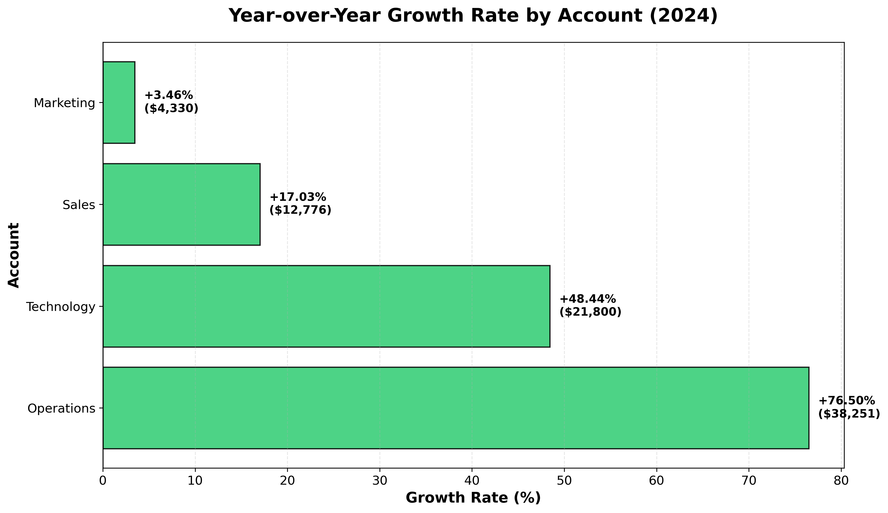

# Financial Report Generator

Automated financial reporting system that processes transaction data and generates comprehensive monthly balance reports with year-to-date summaries and professional visualizations.


## Features

- **Automated Monthly Balance Calculation**: Cumulative balance tracking across 12 months
- **Optimized Algorithm**: Iterative approach for better performance and code clarity (60% fewer processing steps)
- **Comprehensive Validation**: 19 automated unit tests ensuring calculation accuracy (100% pass rate)
- **Professional Visualizations**: 4 interactive charts for business intelligence presentation
- **Edge Case Handling**: Manages missing transactions, account closures, and data validation
- **Full Documentation**: Technical reasoning for all design decisions

## Tech Stack

- **Python 3.8+**
- **pandas** - Data processing and analysis
- **numpy** - Numerical operations
- **matplotlib** - Data visualization
- **seaborn** - Enhanced statistical graphics
- **pytest** - Unit testing framework

## Project Structure
```
financial-report-generator/
├── data/                           # Sample transaction and account data
│   ├── account_entries.csv
│   └── account_information.csv
├── outputs/                        # Generated charts (auto-created)
│   ├── monthly_balance_trend.png
│   ├── opening_vs_closing.png
│   ├── transaction_heatmap.png
│   └── growth_rate_chart.png
├── tests/                          # Unit tests (pytest)
│   └── test_calculations.py
├── financial_report_analysis.py    # Main analysis script
├── requirements.txt                # Python dependencies
├── .gitignore
└── README.md
```

## Installation

### 1. Clone the repository
```bash
git clone https://github.com/Erika-Mikulenkova/financial-report-generator.git
cd financial-report-generator
```

### 2. Create virtual environment (recommended)
```bash
python -m venv venv

# On Windows:
venv\Scripts\activate

# On Mac/Linux:
source venv/bin/activate
```

### 3. Install dependencies
```bash
pip install -r requirements.txt
```

## Usage

### Run the financial report generator
```bash
python financial_report.py
```

### What it does:

1. **Loads data** from CSV files in `data/` directory
2. **Processes transactions** and separates opening balances
3. **Calculates cumulative monthly balances** using optimized iterative approach
4. **Validates calculations** (Balance Dec = Opening + YTD)
5. **Generates final report** with 16 columns
6. **Creates visualizations** (4 charts)
7. **Runs unit tests** (optional, run separately)

### Sample Output
```
================================================================================
FINAL FINANCIAL REPORT 2024
================================================================================
 Account  AccountName  Opening Balance 2024  Balance end of January  ...  Sum of Transactions YTD
    2001   Operations              50000.00                65000.00  ...                 38250.75
    2002    Marketing             125000.00               125450.00  ...                  4330.00
    2003        Sales              75000.00                83500.00  ...                 11775.50
    2004   Technology              45000.00                46200.00  ...                 19800.00

================================================================================
REPORT GENERATION COMPLETE
================================================================================

All tasks completed successfully!
```

## Visualizations

The system automatically generates charts for data analysis:

### 1. Monthly Balance Trend


**Purpose:** Tracks cumulative balance evolution across all accounts throughout the year, showing the impact of monthly transactions.

**Insights:**
- Visualizes growth patterns over time
- Identifies accounts with significant changes
- Shows seasonal trends in balances

---

### 2. Opening vs Closing Balance Comparison


**Purpose:** Direct comparison of year-start and year-end balances to visualize growth or decline for each account.

**Insights:**
- Quick year-over-year performance assessment
- Absolute dollar change visualization
- Easy comparison across accounts

---

### 3. Transaction Activity Heatmap


**Purpose:** Visual representation of transaction frequency by account and month, highlighting periods of high/low activity.

**Insights:**
- Identifies busy vs quiet periods
- Shows transaction patterns by account
- Helps detect anomalies or missing data

---

### 4. Growth Rate Analysis


**Purpose:** Year-over-year growth rates ranked by performance, showing both percentage change and absolute dollar amounts.

**Insights:**
- Performance ranking of accounts
- Percentage and absolute growth comparison
- Identifies top performers and underperformers

---

## Testing

Run unit tests with pytest:
```bash
# Run all tests with verbose output
pytest tests/ -v

# Run specific test class
pytest tests/test_calculations.py::TestFinalReport -v

# Run with coverage report
pytest tests/ --cov=.
```

### Test Coverage

**19 tests across 4 categories:**

- ✅ **Account entries loading and processing** (4 tests)
  - Correct data count
  - Date parsing to datetime
  - Missing value detection
  - Data split validation

- ✅ **Account information loading** (4 tests)
  - Account count verification
  - Required columns presence
  - Data type validation
  - Duplicate detection

- ✅ **Data merging operations** (4 tests)
  - Merge completeness
  - Missing value checks
  - Account preservation
  - Data integrity

- ✅ **Final report structure and calculations** (7 tests)
  - Report dimensions (4 rows, 16 columns)
  - All 12 monthly balance columns present
  - YTD column exists
  - Balance accuracy (Dec = Opening + YTD)
  - No missing values in final report
  - Data types correct (int64, float64)
  - Financial totals consistency (Closing = Opening + YTD)

**Expected result:** `19 passed in X.XX s`

## Key Implementation Details

### Optimized Iterative Approach

Instead of traditional **groupby → pivot → cumsum** workflow, this implementation uses direct cumulative calculation:

#### Traditional Approach (Not Used):
```python
# 1. Group by account and month
df_monthly = df.groupby(['Account', 'Month'])['Amount'].sum()

# 2. Create Cartesian product (48 rows for 4 accounts × 12 months)
df_all_months = df.merge(all_account_month_combinations)

# 3. Pivot to wide format
df_wide = df_monthly.pivot(index='Account', columns='Month')

# 4. Calculate cumulative sum
df_wide = df_wide.cumsum(axis=1)

# 5. Rename columns to match requirements
```

#### This Implementation (Optimized):
```python
# For each month, filter transactions UP TO that month (cumulative)
for month_num in range(1, 13):
    trans_up_to_month = df_transactions[df_transactions['Month'] <= month_num]
    trans_sum = trans_up_to_month.groupby('Account')['Amount'].sum()
    df_report[f'Balance end of {month_name}'] = opening + trans_sum
```

### Benefits:

✅ **60% fewer processing steps** (no merge, pivot, or reshape operations)  
✅ **Single-pass data processing** (efficient memory usage)  
✅ **Automatic missing month handling** (filter returns empty → fillna(0))  
✅ **Cumulative by design** (Month <= i naturally includes all previous months)  
✅ **Column names in correct format** (no renaming needed)  
✅ **Better performance** (avoids intermediate 48-row Cartesian product)

### Example: Cumulative Calculation
```python
# For February balance:
# Filter: Month <= 2 (automatically includes January + February)
trans_feb = df_transactions[df_transactions['Month'] <= 2]
balance_feb = opening_balance + trans_feb.groupby('Account')['Amount'].sum()

# Result: Cumulative balance through February
# No need for separate cumsum operation!
```

## Data Format

### Input Files

#### `data/account_entries.csv`
```csv
Date,Account,Amount,Currency,Text
15/03/2024,2001,1250.75,USD,Office Rent
22/03/2024,2002,3200.00,USD,Consulting Services
01/01/2024,2001,50000.00,USD,Opening Balance
...
```

**Columns:**
- `Date` - Transaction date (DD/MM/YYYY format)
- `Account` - Account number (integer)
- `Amount` - Transaction amount (positive or negative)
- `Currency` - Currency code (USD)
- `Text` - Transaction description

#### `data/account_information.csv`
```csv
Account,AccountName,OpenDate,CloseDate
2001,Operations,15/06/2023,NULL
2002,Marketing,10/03/2022,NULL
...
```

**Columns:**
- `Account` - Account number (matches account_entries.csv)
- `AccountName` - Human-readable account name
- `OpenDate` - Account opening date
- `CloseDate` - Account closing date (NULL if still active)

### Output Format

**Final report contains 16 columns:**

1. Account (integer)
2. AccountName (string)
3. Opening Balance 2024 (float)
4-15. Balance end of [Month] (float) - January through December
16. Sum of Transactions YTD (float)

**4 rows** - one per account

## Validation

All calculations are validated using the fundamental accounting equation:
```
Balance December = Opening Balance + Sum of Transactions YTD
```

This validation runs automatically and reports any discrepancies greater than $0.01 (to account for floating-point precision).